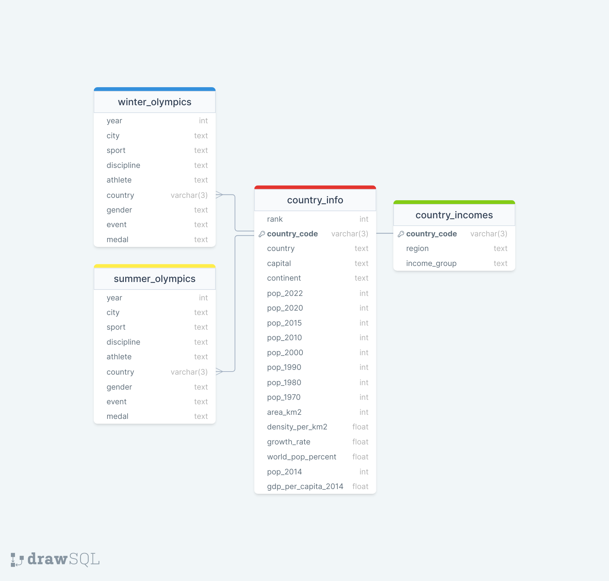
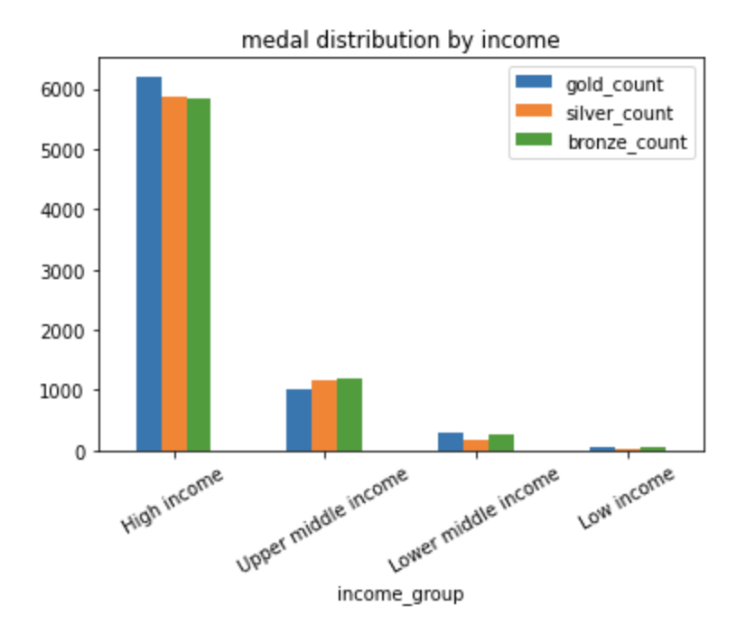

# SQL Project - Creating an Olympic Games Database

```sql

CREATE DATABASE data351_final;


-- CREATE SUMMER OLYMPICS TABLE
CREATE TABLE summer_olympics(
  YEAR INTEGER,
  City TEXT, 
  Sport TEXT, 
  Discipline TEXT,
  Athlete TEXT, 
  Country VARCHAR(3),
  Gender TEXT,
  Event TEXT, 
  Medal TEXT
);

-- COPY OVER TABLE
COPY summer_olympics
FROM '/Users/alexweirth/Documents/data_351/final_project/summer.csv'
WITH(FORMAT CSV, HEADER);


------- CREATE WINTER OLYMPICS TABLE --------
CREATE TABLE winter_olympics(
  YEAR INTEGER,
  City TEXT, 
  Sport TEXT, 
  Discipline TEXT,
  Athlete TEXT, 
  Country VARCHAR(3),
  Gender TEXT,
  Event TEXT, 
  Medal TEXT
);

-- COPY OVER TABLE
COPY winter_olympics
FROM '/Users/alexweirth/Documents/data_351/final_project/winter.csv'
WITH(FORMAT CSV, HEADER);


----------- CREATE COUNTRY CODE TABLE -----------
CREATE TABLE country_codes(
  Country TEXT, 
  Code VARCHAR(3),
  Population INTEGER, 
  "GDP per Capita" NUMERIC
);

COPY country_codes
FROM '/Users/alexweirth/Documents/data_351/final_project/dictionary.csv'
WITH(FORMAT CSV, HEADER);

ALTER TABLE country_codes RENAME population TO pop_2014;
ALTER TABLE country_codes RENAME "GDP per Capita" TO gdp_per_capita_2014;


----------- CREATING COUNTRY INFO TABLE ----------
CREATE TABLE country_info(
  RANK INTEGER,
  CCA3 VARCHAR(3) PRIMARY KEY,
  "Country/Territory" TEXT,
  Capital TEXT,
  Continent TEXT,
  "2022 Population" INTEGER,
  "2020 Population" INTEGER,	
  "2015 Population" INTEGER,	
  "2010 Population" INTEGER,
  "2000 Population" INTEGER,	
  "1990 Population" INTEGER,	
  "1980 Population" INTEGER,	
  "1970 Population" INTEGER,	
  "Area (km²)" INTEGER,
  "Density (per km²)" NUMERIC,
  "Growth Rate" NUMERIC,
  "World Population Percentage" NUMERIC(4,2)
);

-- copy data to country info table
COPY country_info
FROM '/Users/alexweirth/Documents/data_351/final_project/world_population.csv'
WITH(FORMAT CSV, HEADER);


-- cleaning col names for country info
ALTER TABLE country_info RENAME cca3 TO country_code;
ALTER TABLE country_info RENAME "Country/Territory" TO country;
ALTER TABLE country_info RENAME "2022 Population" TO pop_2022;
ALTER TABLE country_info RENAME "2020 Population" TO pop_2020;
ALTER TABLE country_info RENAME "2015 Population" TO pop_2015;
ALTER TABLE country_info RENAME "2010 Population" TO pop_2010;
ALTER TABLE country_info RENAME "2000 Population" TO pop_2000;
ALTER TABLE country_info RENAME "1990 Population" TO pop_1990;
ALTER TABLE country_info RENAME "1980 Population" TO pop_1980;
ALTER TABLE country_info RENAME "1970 Population" TO pop_1970;
ALTER TABLE country_info RENAME "Area (km²)" TO area_km2;
ALTER TABLE country_info RENAME "Density (per km²)" TO density_per_km2;
ALTER TABLE country_info RENAME "Growth Rate" TO growth_rate;
ALTER TABLE country_info RENAME "World Population Percentage" TO world_pop_percent;


------------ CREATING INCOME TABLE ------------
CREATE TABLE country_incomes(
  country_code VARCHAR(3) PRIMARY KEY,
  region TEXT,
  income_group TEXT
);

-- copy over data
COPY country_incomes
FROM '/Users/alexweirth/Documents/data_351/final_project/gdp_data.csv'
WITH(FORMAT CSV, HEADER);


-- I dont need the country codes table, but we want to preserve the 2014 population and gdp data
-- since it corresponds to the 2014 winter olympics year and could be valuable

ALTER TABLE country_info ADD COLUMN pop_2014 INTEGER;
ALTER TABLE country_info ADD COLUMN gdp_per_capita_2014 NUMERIC;

UPDATE country_info
SET pop_2014 = country_codes.pop_2014
FROM country_codes
WHERE country_info.country_code = country_codes.code OR country_info.country = country_codes.country;

UPDATE country_info
SET gdp_per_capita_2014 = country_codes.gdp_per_capita_2014
FROM country_codes
WHERE country_info.country_code = country_codes.code OR country_info.country = country_codes.country;

-- now, all the data I had in the country codes table for gdp and population is in our country_info table, so we can drop
-- the redundant table

DROP TABLE country_codes;

---------------------------- CREATING PRIMARY AND FOREIGN KEYS ----------------------------

-- 1. olympic tables primary keys - we will add a serial column and then add primary keys to the table on that column
ALTER TABLE summer_olympics ADD COLUMN id SERIAL;
ALTER TABLE summer_olympics ADD PRIMARY KEY (id);

ALTER TABLE winter_olympics ADD COLUMN id SERIAL;
ALTER TABLE winter_olympics ADD PRIMARY KEY (id);

-- 2. country_info has a primary key on country_code

-- 3. country_incomes has a primary key on country_code


-- FOREIGN KEYS

-- first I had to delete all the entries of the olympics and income table that do not have a match in country_info

DELETE FROM winter_olympics WHERE 
country ='BUL' OR
country ='CRO' OR
country ='DEN' OR
country ='EUA' OR
country ='EUN' OR
country ='FRG' OR
country ='GDR' OR
country ='GER' OR
country ='LAT' OR
country ='NED' OR
country ='SLO' OR
country ='SUI' OR
country ='TCH' OR
country ='URS' OR
country ='YUG';


DELETE FROM summer_olympics WHERE 
country ='AHO' OR
country ='ALG' OR
country ='ANZ' OR
country ='BAH' OR
country ='BAR' OR
country ='BER' OR
country ='BOH' OR
country ='BOT' OR
country ='BUL' OR
country ='BWI' OR
country ='CHI' OR
country ='CRC' OR
country ='CRO' OR
country ='DEN' OR
country ='EUA' OR
country ='EUN' OR
country ='FRG' OR
country ='GDR' OR
country ='GER' OR
country ='GRE' OR
country ='GRN' OR
country ='GUA' OR
country ='HAI' OR
country ='INA' OR
country ='IOP' OR
country ='IRI' OR
country ='ISV' OR
country ='KSA' OR
country ='KUW' OR
country ='LAT' OR
country ='LIB' OR
country ='MAS' OR
country ='MGL' OR
country ='MRI' OR
country ='NED' OR
country ='NGR' OR
country ='NIG' OR
country ='PAR' OR
country ='PHI' OR
country ='POR' OR
country ='PUR' OR
country ='RSA' OR
country ='RU1' OR
country ='SCG' OR
country ='SIN' OR
country ='SLO' OR
country ='SRI' OR
country ='SUD' OR
country ='SUI' OR
country ='TAN' OR
country ='TCH' OR
country ='TGA' OR
country ='TOG' OR
country ='TPE' OR
country ='TRI' OR
country ='UAE' OR
country ='URS' OR
country ='URU' OR
country ='VIE' OR
country ='YUG' OR
country ='ZAM' OR
country ='ZIM' OR
country ='ZZX';

DELETE FROM country_incomes WHERE 
country_code ='EAS' OR
country_code ='FCS' OR
country_code ='HPC' OR
country_code ='SST' OR
country_code ='SSF' OR
country_code ='IBD' OR
country_code ='CEB' OR
country_code ='ARB' OR
country_code ='MIC' OR
country_code ='LAC' OR
country_code ='SAS' OR
country_code ='IDA' OR
country_code ='ECS' OR
country_code ='TLA' OR
country_code ='WLD' OR
country_code ='MNP' OR
country_code ='LDC' OR
country_code ='ECA' OR
country_code ='IDX' OR
country_code ='AFW' OR
country_code ='CSS' OR
country_code ='LMY' OR
country_code ='PST' OR
country_code ='PRE' OR
country_code ='CHI' OR
country_code ='LIC' OR
country_code ='LCN' OR
country_code ='OSS' OR
country_code ='EMU' OR
country_code ='MNA' OR
country_code ='EAR' OR
country_code ='TSS' OR
country_code ='SSA' OR
country_code ='IBT' OR
country_code ='OED' OR
country_code ='HIC' OR
country_code ='TEC' OR
country_code ='AFE' OR
country_code ='NAC' OR
country_code ='IDB' OR
country_code ='EAP' OR
country_code ='TEA' OR
country_code ='TSA' OR
country_code ='TMN' OR
country_code ='XKX' OR
country_code ='PSS' OR
country_code ='LMC' OR
country_code ='UMC' OR
country_code ='MEA' OR
country_code ='LTE' OR
country_code ='EUU';

---------- ADDING FOREIGN KEYS NOW THAT ALL RELATED TABLES HAVE MATCHES TO COUNTRY_INFO --------------
ALTER TABLE winter_olympics ADD FOREIGN KEY (country) REFERENCES country_info(country_code);

ALTER TABLE summer_olympics ADD FOREIGN KEY (country) REFERENCES country_info(country_code);

ALTER TABLE country_incomes ADD FOREIGN KEY (country_code) REFERENCES country_info(country_code);
```

## Final Database Strucutre:



# Visualization

I also wanted to take this project a step further and do some visulaization while I had the data ready; I wanted to see if an economic
factor, such as income group, had a relationship with earning gold medal vs. silver or bronze in the olympics. We used python and matplotlib to do this.

```sql
-- Query #2
-- creating a table for frequency distribution of medals for different categorical income brackets, exported and uploaded to github as "medal_dist.csv"
CREATE TABLE gold_medals AS(
  SELECT cinc.income_group, COUNT(*) AS gold_count
  FROM summer_olympics AS sm
  JOIN country_info AS ci ON ci.country_code = sm.country
  JOIN country_incomes AS cinc ON cinc.country_code = ci.country_code
  GROUP BY income_group, medal
  HAVING income_group IS NOT NULL AND medal = 'Gold'
  ORDER BY income_group
);

CREATE TABLE silver_medals AS(
  SELECT cinc.income_group, COUNT(*) AS silver_count
  FROM summer_olympics AS sm
  JOIN country_info AS ci ON ci.country_code = sm.country
  JOIN country_incomes AS cinc ON cinc.country_code = ci.country_code
  GROUP BY income_group, medal
  HAVING income_group IS NOT NULL AND medal = 'Silver'
  ORDER BY income_group
);

CREATE TABLE bronze_medals AS(
  SELECT cinc.income_group, COUNT(*) AS bronze_count
  FROM summer_olympics AS sm
  JOIN country_info AS ci ON ci.country_code = sm.country
  JOIN country_incomes AS cinc ON cinc.country_code = ci.country_code
  GROUP BY income_group, medal
  HAVING income_group IS NOT NULL AND medal = 'Bronze'
  ORDER BY income_group
);

COPY(
  SELECT g.income_group, g.gold_count, s.silver_count, b.bronze_count
  FROM gold_medals AS g
  JOIN silver_medals AS s on s.income_group = g.income_group
  JOIN bronze_medals AS b on b.income_group = g.income_group
  ORDER BY gold_count DESC
)
TO '/Users/alexweirth/Documents/data_351/final_project/medal_dist.csv'
WITH(FORMAT CSV, HEADER);
```
## Python Notebook
```python
import matplotlib.pyplot as plt
medal_counts = pd.read_csv('/Users/alexweirth/Documents/data_351/final_project/medal_dist.csv')
```

## Medal distribution colored by income group:
```python
medal_counts.plot(x='income_group',
        kind='bar',
        stacked=False,
        title='medal distribution by income',
        )
plt.xticks(rotation = 30)
```

