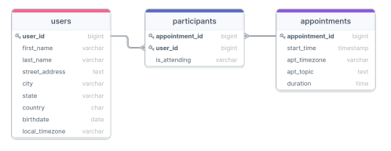
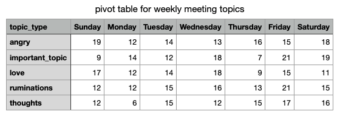

# Working with meeting/appointment data relevant for a calendar application.

## Data structure:



#### Querying users that attended meetings on their birthdays:

```sql
SELECT COUNT(*) AS birthday_meetings
FROM hw8.users AS u
JOIN hw8.participants AS P
	ON p.user_id = u.user_id
JOIN hw8.appointments as a 
	ON a.appointment_id = p.appointment_id
WHERE EXTRACT(MONTH FROM a.start_time) = EXTRACT(MONTH FROM u.birthdate) AND
	EXTRACT(DAY FROM a.start_time) = EXTRACT(DAY FROM u.birthdate) AND
  p.is_attending ILIKE 'Yes'
;
```

#### Querying conflicting meetings for "Simon Smith" (reporting appointment ID's and starting and ending times of meetings in Simon's time zone).

```sql
--This query creates a table for all of Simons scheduled meetings
CREATE TABLE simon_meetings AS (
  SELECT a.appointment_id, 
	(a.start_time AT TIME ZONE a.apt_timezone) AS start_time_wtz,
    ((a.start_time + a.duration) AT TIME ZONE a.apt_timezone) AS end_time_wtz
  FROM hw8.appointments AS a
  JOIN hw8.participants AS P 
    ON p.appointment_id = a.appointment_id
  JOIN hw8.users as u 
    ON u.user_id = p.user_id
  WHERE u.user_id = 12 AND p.is_attending ILIKE 'Yes'
);

-- This query then joins the table with itself and returns rows meetings that overlapped with another using the OVERLAP keyword.
SELECT sm.appointment_id, sm.start_time_wtz, sm.end_time_wtz, sm2.appointment_id, sm2.start_time_wtz, sm2.end_time_wtz
FROM simon_meetings AS sm
JOIN simon_meetings AS sm2 
  ON sm2.appointment_id != sm.appointment_id
WHERE (sm.start_time_wtz, sm.end_time_wtz) OVERLAPS (sm2.start_time_wtz, sm2.end_time_wtz)
;
```

### Pivot table for weekly meeting topics (each appointments.apt_topic has a general starting prompt all of which you can see in the output).

#### Query:

```sql
CREATE EXTENSION tablefunc;

SELECT * 
FROM crosstab(
  $$
    -- Row Label Values
    SELECT CASE 
      WHEN apt_topic LIKE 'I am angry about%' THEN 'angry'
      WHEN apt_topic LIKE 'Important topic:%' THEN 'important_topic'
      WHEN apt_topic LIKE 'Thoughts on%' THEN 'thoughts'
      WHEN apt_topic LIKE 'I love % and you should too!%' THEN 'love'
      WHEN apt_topic LIKE 'Ruminations on the existence of%' THEN 'ruminations'
      END as topic_type,
    -- Col Label Values
    DATE_PART('dow', start_time AT TIME ZONE apt_timezone) AS "dow",
    -- Data Values
    COUNT(*)
    FROM hw8.appointments
    GROUP BY topic_type, "dow"
    ORDER BY "topic_type","dow"
  $$,
  $$
    SELECT DISTINCT date_part('dow', start_time AT TIME ZONE apt_timezone) as dow FROM hw8.appointments
    ORDER BY "dow"
  $$)
AS(
  "topic_type" TEXT,
  "Sunday" INT,
  "Monday" INT,
  "Tuesday" INT,
  "Wednesday" INT,
  "Thursday" INT,
  "Friday" INT,
  "Saturday" INT
))
```

#### Output:


