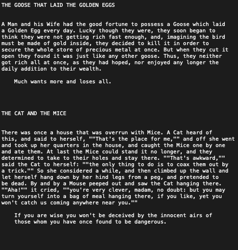

# WORKING WITH TEXT

## Using regular expressions to split text and create tables from a raw .txt file.

### Data:

The original file is a .txt file containing Aesop's Fables as one block of text containing a title, story, and optional moral all uniquely delimited.



#### Query to import the data and split the titles, stories, and morals into seperate columns in the "fables table"

```sql
-- Create the seperated fables table
CREATE TABLE fables(
  title TEXT,
  story TEXT,
  moral TEXT,
  fable_str TEXT
  );

-- inserting fables_split string into a col in fables so it is easier to work with for me
INSERT INTO fables(fable_str)
SELECT * FROM fables_split;

-- Splitting the str into an array based off 3 newline characters and taking the first element which is the title
UPDATE fables SET title = (regexp_split_to_array(fable_str, '\n{3}'))[1];

-- For this, I did the same split into an array above but took the second element which was the story and moral if applicable
UPDATE fables SET story = (regexp_split_to_array(fable_str, '\n{3}'))[2];

-- To get rid of the moral from the story section, I split again on the 2 newline characters which were seperating the story and moral
-- and then I also got rid of any extra spaces since some of the morals were indented.
UPDATE fables SET story = (regexp_split_to_array(story, '\n{2}\s*'))[1];

-- To then get the moral, I did the exact same thing as above, but in the second step, instead of keeping the first indexed item
-- I kept the second which was the moral
UPDATE fables SET moral = (regexp_split_to_array(fable_str, '\n{3}'))[2];
UPDATE fables SET moral = (regexp_split_to_array(moral, '\n{2}\s*'))[2];

-- Drop the helping fable_str column
ALTER TABLE fables DROP COLUMN fable_str
;
```

#### Simple analysis with ts_query on the tsvector type:

##### Creating the tsvector column and adding a generlized inverted index for querying:
```sql
ALTER TABLE fables ADD COLUMN story_vec TSVECTOR;

UPDATE fables SET story_vec = to_tsvector(story);

CREATE INDEX gin_fables ON fables 
USING GIN(story_vec)
;
```

##### Querying fables with "sea" in the story but not "sailor" or "perform":
```sql
SELECT title 
FROM fables
WHERE story_vec @@ to_tsquery('sea & !sailor & !perform')
;
```
Output:
  1) THE FISHERMAN AND THE SPRAT
  2) THE BAT, THE BRAMBLE, AND THE SEAGULL
  3) THE RIVERS AND THE SEA
  4) THE FISHERMAN PIPING
  5) THE CRAB AND THE FOX
  6) THE IMPOSTOR
